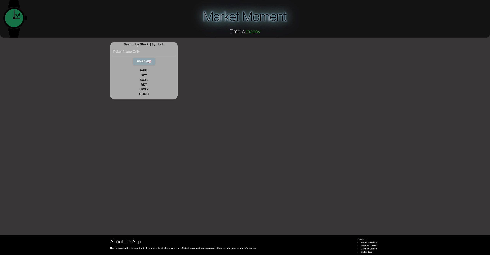
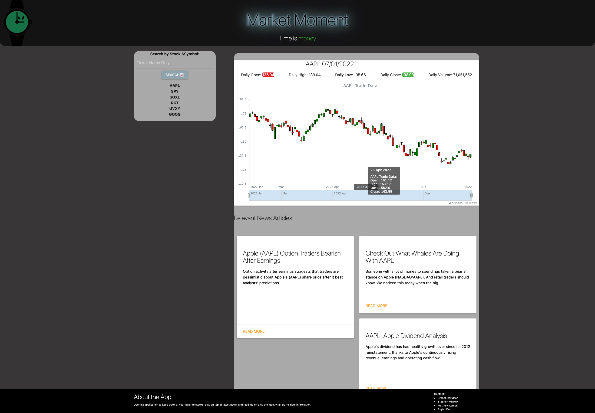

# MarketMoment
Use this application to keep track of your favorite stocks, stay on top of latest news, and read-up on only the most vital, up-to-date information.
## Description of the Project
-   First, we discussed a game plan for the actions we wanted to take, then divided the work according to each individuals preference and skills. 
- Then, as a group we began on the interface and made the general layout correspond with our ideas. At this point, we split up as a team and left the function for the content up to half of our members, and specifics and styles to the other half. 
- The first half, utilized APIs to pull information about stocks we felt vital to the user. 
- The second half, focused on making the page user-friendly and appealing to the eye. After that, we met as a group again to incorporate all of our individual work, as one. Following this step, we made sure everything was flowing well and we had a version that worked and looked exactly how we had envisioned.

## Links 

## Screenshots

### Credits

- Stephen Mulrow
- Matthew Larson
- Skylar Dorn
- Brandt Davidson
